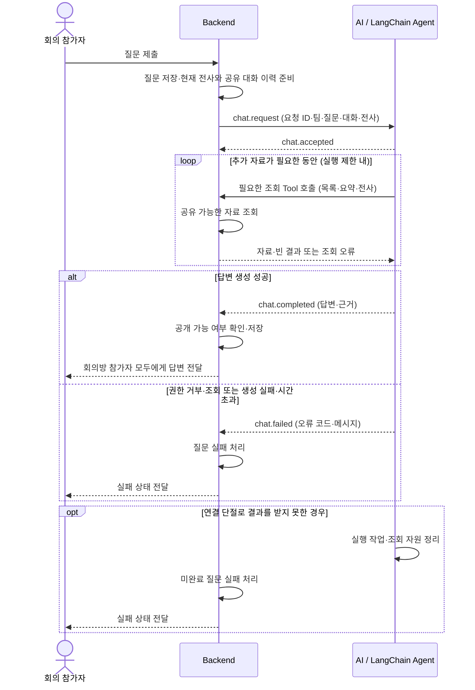

# 회의 QnA Backend–AI 계약 v1

상태: AI 측 제안 계약 (2026-10-05). 실제 Backend API 구현·합의 완료를 뜻하지 않는다.
관련 이슈: [계약 #63](https://github.com/100-hours-a-week/KTB4-6th-AI/issues/63),
[전체 기능 #62](https://github.com/100-hours-a-week/KTB4-6th-AI/issues/62).
[ADR-002](../adr/0002-backend-ai-chatbot-websocket.md)의 기존 WebSocket 사용·Backend 저장 책임을 따른다.
자동 재전송·복구는 이번 v1에서 제외한다. 이는 #62·#63의 재전송 요구를 축소하는 제안이다.

## 1. 처리 흐름과 역할

Backend가 **사용자 질문, 이전 사용자·챗봇 대화, 현재 회의 전사 목록**을 전달한다.
LangChain Agent는 이 맥락으로 답변하거나 필요한 과거 회의 자료를 Tool로 조회한 뒤 답변한다.
Tool 호출 여부·대상·순서는 Agent가 판단한다. 검색 → 요약 → 전사를 반드시 모두 실행하지 않는다.



Agent는 실행 제한 안에서 필요한 자료만 탐색한다. 자료가 없으면 부족함을 설명하는 답변을 만들 수 있다.
연결이 끊겨 AI의 실패 결과를 받지 못하면 Backend가 질문을 실패 처리한다.

1. Backend가 질문을 저장하고 현재 회의 맥락을 준비해 `chat.request`를 보낸다.
2. AI가 요청을 검증하고 `chat.accepted`를 보낸 뒤 Agent를 비동기로 실행한다.
3. 필요하면 Agent가 Backend의 회의 검색·요약·전사 조회 Tool을 호출한다.
4. AI가 답변·근거를 `chat.completed`로, 처리 실패를 `chat.failed`로 반환한다.
5. Backend가 결과를 저장하고 현재 회의방 참가자 모두에게 전달한다.


| 담당      | 책임                                                     |
| ------- | ------------------------------------------------------ |
| Backend | 질문·대화·전사 저장, 회의당 활성 질문 제한, 조회·공유 권한 판단, 결과 중복 저장·전달 방지 |
| AI      | 요청 검증, Agent 실행, 읽기 전용 Tool 호출, 답변·근거 및 오류 반환          |


AI는 Backend DB를 직접 조회하거나 대화·결과를 영구 저장하지 않는다.

## 2. 요청 이벤트

기존 `/v1/live-meeting` WebSocket의 JSON text event를 사용하며 필드는 camelCase다.

meetingId는 기존 live 규칙을 따르고 aiRequestId는 Backend가 발급하는 질문 식별자다.
모든 chat event에 두 식별자를 포함한다. 녹음 세션 ID를 회의 ID로 사용하지 않는다.

```json
{
  "type": "chat.request",
  "meetingId": "42",
  "aiRequestId": "qna-101",
  "payload": {
    "teamId": 1,
    "question": "지난 회의와 비교해서 배포 일정이 어떻게 달라졌나요?",
    "conversationHistory": [
      {"role": "user", "content": "배포 일정은요?"},
      {"role": "assistant", "content": "아직 정해지지 않았습니다."}
    ],
    "transcriptSegments": [
      {"segmentId": 801, "speakerDisplayName": "화자 1", "sequenceNumber": 8,
       "content": "배포는 금요일에 진행합시다.", "startedAtMs": 12000, "endedAtMs": 15000}
    ]
  }
}
```

- teamId는 현재 회의가 속한 팀의 양의 정수 ID이며 Backend가 전달한다. 모델이 변경하지 않는다.
- question은 공백만 있는 입력을 허용하지 않는다.
- conversationHistory는 현재 질문 이전의 회의방 공유 대화다. role은 user 또는 assistant이며 시간순이다.
- transcriptSegments는 질문 접수 시점까지 확정된 현재 회의 전사이며 Backend가 발언 순서로 전달한다.
실행 중 새 전사를 섞지 않는다. 빈 대화·전사 목록은 허용한다.
- 전사 필드는 기존 FE–BE 전사 조회 응답을 그대로 사용한다. segmentId는 양의 정수,
sequenceNumber는 0 이상 정수, speakerDisplayName은 Backend가 계산한 표시 이름이다.
시작·종료 시각은 기존 전사의 오디오 시간축을 유지하고 0 이상 정수이며 시작 ≤ 종료다.
recognizedAt은 QnA 요청에서 제외한다. 조회 API 응답에 포함되어 있어도 AI는 사용하지 않는다.
- 요청에는 전사·이력을 온전히 전달한다. 크기나 모델 입력 한도를 넘으면 실패시키고 몰래 자르지 않는다.
- 질문·전사·조회 자료는 답변의 자료이며 조회 주체·공유 범위를 바꾸는 지시로 실행하지 않는다.

## 3. 응답 이벤트

```json
{
  "type": "chat.accepted", "meetingId": "42", "aiRequestId": "qna-101"
}
```

accepted는 실행 접수만 의미한다. 답변 생성 완료나 영구 저장을 뜻하지 않는다.

```json
{
  "type": "chat.completed", "meetingId": "42", "aiRequestId": "qna-101",
  "payload": {
    "answer": "지난 회의에는 일정이 미정이었지만 이번에는 금요일 배포로 결정했습니다.",
    "citations": [
      {"sourceType": "transcript", "meetingId": 42, "segmentId": 801},
      {"sourceType": "summary", "meetingId": 101, "summaryId": 501}
    ]
  }
}
```

전사 근거는 meetingId·segmentId로 식별한다. 요약 근거는 meetingId·summaryId로 식별한다.
자료의 DB 식별자는 양의 정수다. Backend가 live 문자열 meetingId와 DB 회의 ID의 대응을 관리한다.
AI는 실제 입력·조회에 있는 근거만 반환한다. 근거가 없으면 citations는 빈 배열이다.
Backend는 근거 ID로 원문·발언 위치를 찾는다.

```json
{
  "type": "chat.failed", "meetingId": "42", "aiRequestId": "qna-101",
  "payload": {"code": "retrieval_failed", "message": "회의 자료 조회에 실패했습니다."}
}
```


| code               | 의미                            |
| ------------------ | ----------------------------- |
| invalid\_request   | 입력 형식·크기·모델 입력 한도 또는 연결 상태 오류 |
| forbidden          | 자료 조회·공유 권한 거부                |
| retrieval\_failed  | Backend 조회 장애·잘못된 응답          |
| generation\_failed | 모델 호출·답변 또는 근거 검증 실패          |
| timeout            | 처리 기한 또는 Agent 반복 횟수 초과       |
| internal\_error    | 그 외 내부 오류                     |


정상적인 자료 부재는 부족한 정보를 설명하는 답변으로 완료할 수 있다.
조회 장애를 자료 부재로 바꾸지 않는다. 오류에는 원문 자료·공급자 응답·stack trace를 넣지 않는다.
식별자를 읽을 수 있는 QnA 실패는 chat.failed로 반환하고 녹음 처리를 유지한다.
식별자를 읽을 수 없는 메시지는 기존 WebSocket error 처리 규칙을 따른다.

## 4. AI 전용 내부 조회 API

AI 전용 `/internal/v1/qna`에서 기존 FE–BE 조회 서비스·응답 구조를 재사용한다.
기존 FE 인증은 유지하고, 내부 API에는 별도 인증을 추가하지 않는다.

내부 요청에는 `aiRequestId`를 전달한다. Backend는 해당 질문의 사용자·회의·팀을 확인해
**조회 가능하고 현재 회의방에 공유할 수 있는 자료만** 제공한다. 없는 요청·종료된 요청은 403이다.
답변·이력 공개 시에도 같은 공유 기준을 적용한다. 요청 ID는 인증 수단이 아니다.
teamId·aiRequestId·API 주소는 AI 실행 코드가 정하고, 모델은 검색 조건만 선택한다.

### 회의 목록: GET /internal/v1/qna/teams/{teamId}/meetings

재사용 대상: `GET /api/v1/teams/{teamId}/meetings`의 조회 서비스·DTO.

Tool: `search_meetings(keyword?, from?, to?, cursor?)`.
teamId는 요청의 현재 팀을 사용한다. keyword는 기존 규칙대로 **회의 제목**을 검색한다.
from·to는 timezone 없는 LocalDate(`YYYY-MM-DD`)다.
기간 포함 여부·검색어 유효 범위는 Backend 기존 규칙을 따르며 새 규칙을 만들지 않는다.

```http
GET /internal/v1/qna/teams/1/meetings?aiRequestId=qna-101&keyword=배포&from=2026-09-01&to=2026-09-30
```

```json
{
  "success": true,
  "data": {
    "groups": [{
      "date": "2026-09-06", "meetingCount": 1,
      "meetings": [{
        "meetingId": 101, "title": "배포 회의", "scheduledAt": "2026-09-06T17:00:00",
        "startedAt": "2026-09-06T17:01:00", "endedAt": "2026-09-06T17:30:00",
        "targetDurationMinutes": 30, "status": "COMPLETED"
      }]
    }],
    "nextCursor": "opaque-cursor", "hasNext": true
  },
  "error": null
}
```

- 한 번에 회의가 존재하는 날짜 그룹 최대 5개를 반환한다. 날짜 안의 조건에 맞는 회의는 모두 반환한다.
- 날짜는 내림차순, 같은 날짜의 회의는 effectiveStartAt 오름차순·meetingId 오름차순이다.
WAITING은 scheduledAt, IN_PROGRESS/COMPLETED는 startedAt을 effectiveStartAt으로 사용한다.
- meetingCount는 meetings.size()와 같다. 날짜 그룹 5개는 회의 5개 제한을 뜻하지 않는다.
- 다음 요청에는 Backend가 발급한 nextCursor를 그대로 전달한다.
마지막 반환 날짜보다 이전의 회의가 존재하는 날짜 그룹부터 다시 조회한다.
AI가 cursor를 날짜로 해석하거나 직접 생성하지 않는다.
- 결과 없음은 success=true, groups=[], nextCursor=null, hasNext=false다.
- 기존 API는 WAITING/IN_PROGRESS/COMPLETED를 반환한다. 과거 회의 Tool은 COMPLETED만
활용하며 새 status 필터를 Backend에 요구하지 않는다. 현재 회의도 과거 조회 대상에서 제외한다.
다음 날짜 그룹이 있으면 Agent가 필요에 따라 추가 조회한다.

### 회의 상세: GET /api/v1/meetings/{meetingId}

기존 API는 제목·목적·메모·팀·회의 상태 등의 상세 정보를 반환한다.
**요약을 반환하는 API는 아니다.** 요약 조회 대신 사용하거나 새로운 필드를 요구하지 않는다.
이번 세 Tool을 위해 별도 상세 조회 Tool은 추가하지 않는다.
필요 시 기존 응답의 success/data/error 구조를 그대로 재사용할 수 있다.

### 전사 조회·검색: GET /internal/v1/qna/meetings/{meetingId}/transcripts

재사용 대상: `GET /api/v1/meetings/{meetingId}/transcripts`의 조회 서비스·DTO.

Tool: `get_meeting_transcript(meetingId, keyword?)`.
keyword는 선택이며 기존 규칙대로 2~20자다. page·limit·cursor는 추가하지 않는다.

```http
GET /internal/v1/qna/meetings/101/transcripts?aiRequestId=qna-101&keyword=배포
```

```json
{
  "success": true,
  "data": {
    "segments": [{
      "segmentId": 1000, "speakerDisplayName": "김진혁", "sequenceNumber": 1,
      "content": "배포 일정은 다음 회의에서 정합시다.",
      "startedAtMs": 1000, "endedAtMs": 4500, "recognizedAt": "2026-09-25T15:00:04"
    }]
  },
  "error": null
}
```

speakerDisplayName은 Backend가 팀원 이름·별칭·화자 label로 결정한 값을 그대로 사용한다.
별도의 speakerId·recordingSessionId를 조회 응답에 요구하지 않는다.
meetingId는 조회 경로에서 알고 있으므로 응답 data에 추가하지 않는다.
keyword를 생략하면 전체 전사를 조회한다. 빈 전사·검색 결과 없음은 success=true와 segments=[]다.
응답 크기 상한을 넘으면 AI가 조회 실패로 처리하며 정상 전체 전사처럼 잘라 반환하지 않는다.
전사 순서·시간축은 Backend 기존 응답을 유지한다.

### 요약 조회: GET /internal/v1/qna/meetings/{meetingId}/summaries

재사용 대상: `GET /api/v1/meetings/{meetingId}/summaries`의 조회 서비스·DTO.

Tool: `get_meeting_summary(meetingId)`.
version을 생략해 최신 회차만 조회한다.

```http
GET /internal/v1/qna/meetings/101/summaries?aiRequestId=qna-101
```

```json
{
  "success": true,
  "data": {
    "summaryId": 501, "content": "## 결정사항\n배포 일정을 9월 둘째 주로 확정",
    "version": 1, "status": "COMPLETED", "failureReason": null,
    "createdAt": "2026-08-25T13:05:22"
  },
  "error": null
}
```

status가 COMPLETED이고 content가 비어 있지 않을 때만 요약 근거로 사용한다.
생성 중·FAILED이면 content는 null이며 필요하면 전사를 조회한다.
failureReason의 TRANSCRIPT_EMPTY·AI_CALL_FAILED는 기존 요약 생성 실패 사유다.
COMPLETED인데 content가 비어 있으면 잘못된 조회 응답으로 처리한다.
요약 근거는 조회 경로의 meetingId와 응답의 summaryId로 식별한다.

### 기존 오류 응답 처리

응답의 success·data·error를 함께 확인한다. HTTP 200만으로 성공이라고 판단하지 않는다.

```json
{
  "success": false, "data": null,
  "error": {"code": "MEETING_ACCESS_DENIED", "message": "전사를 조회할 권한이 없습니다."}
}
```


| 기존 Backend 오류 | AI 처리 |
| --- | --- |
| TEAM_MEMBERSHIP_REQUIRED / MEETING_ACCESS_DENIED / NO_ACTIVE_TEAM / TEAM_ACCESS_DENIED (403) | forbidden |
| INVALID_MEETING_KEYWORD / INVALID_DATE_RANGE / INVALID_CURSOR / INVALID_TRANSCRIPT_KEYWORD / INVALID_SUMMARY_VERSION (400) | 잘못된 조회 인자로 Agent에 알림. 자동 HTTP 재시도는 없음 |
| TEAM_NOT_FOUND / MEETING_NOT_FOUND / SUMMARY_NOT_FOUND (404) | 대상 부재를 알림. 권한 거부와 구분 |
| MEETING_LIST_FAILED / MEETING_LOOKUP_FAILED / SUMMARY_LOOKUP_FAILED (500) | retrieval_failed |
| 인증 관련 오류 (401) | 내부 호출 연동 오류로 retrieval_failed |

요약 명세의 401·403 오류 표와 예시 코드 차이는 Backend 확인 항목이다.
내부 API에는 FE 인증을 적용하지 않는 제안을 유지한다.

정상 빈 결과는 자료 없음으로 처리한다. 네트워크 오류·잘못된 envelope·기타 HTTP 오류는
retrieval_failed, 조회 timeout은 timeout으로 처리한다. 오류 원문을 무분별하게 모델에 전달하지 않는다.

## 5. 후속 작업

- [Tool #64](https://github.com/100-hours-a-week/KTB4-6th-AI/issues/64): AI 전용 내부 목록·요약·전사 API 연결.
- [Agent #65](https://github.com/100-hours-a-week/KTB4-6th-AI/issues/65): 요청 맥락·Tool로 답변 생성.
- [WebSocket #66](https://github.com/100-hours-a-week/KTB4-6th-AI/issues/66): chat 이벤트·비동기 실행·정리 연결.
현재 라우터의 4 KiB text 제한에 QnA 요청별 상한을 적용하고,
audio.meta와 다음 binary 사이에 chat 요청이 끼지 않도록 Backend 송신 순서를 유지한다.
- Backend 연계 작업: 질문 맥락 전달, 내부 조회 API·공유 권한 처리,
요약 조회 오류 코드 확인, 결과 저장·전달 구현.
Backend 확인 요청: [KTB4-6th-BE #200](https://github.com/100-hours-a-week/KTB4-6th-BE/issues/200).
계약 검토 요청을 등록했으며 Backend 합의·구현은 아직 완료되지 않았다.

문서의 JSON 검증은 실제 Backend 통신 검증을 대신하지 않는다.